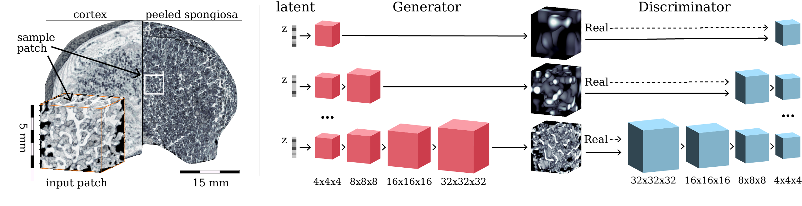

# Generative Modelling of 3D in-silico Spongiosa with Controllable Micro-Structural Parameters
Code, data, and trained models from the [MICCAI 2020](https://miccai2020.org/en/default.asp) paper. We developed a method to create micro-structural bone samples in-silico that 1) contain realistic structures, and 2) allow to steer the properties to simulate changes of micro-structural parameters from deterioration or medical bone treatment.



## Requirements
Python 3.+ and PyTorch 1.0.0.

The code has been tested only with PyTorch 1.0.0, there are no guarantees that it is compatible with older versions. 

## Clone repo
```
$ git clone https://github.com/emmanueliarussi/generative3DSpongiosa.git
$ cd generative3DSpongiosa
```
## Basic usage
Before training, [download paper's data](https://github.com/emmanueliarussi/generative3DSpongiosa/blob/master/data/patches_32x32x32.zip) and unzip it inside data folder.

```
$ conda env create -f environment.yml
$ conda activate generativespongiosa
$ cd code
$ python train.py
```
## Sampling new bone

```
$ cd code
$ python synthesize_random_samples.py --num_samples 20
```

## References
*coming soon!*

